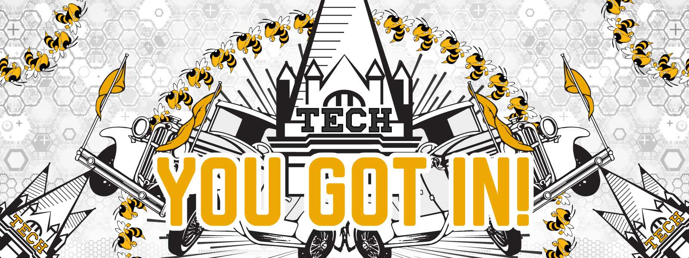

<!-- Main -->

<!-- Page title -->

    <!-- Welcome Banner -->
    
        
    
    <header class="major">
        <h1>Congratulations on your acceptance!</h1>
    </header>

<!-- Introduction -->
You have made through the toughest part of the admission process- getting in. International Ambassadors at Georgia Tech look forward to meeting you in the fall! Meanwhile, dive into the guide we have assembled for the incoming international freshmen - a specialized FAQ sheet just to cater to your individual needs through the transition. If you can’t find answer to your queries through the resources provided in this website, please <a href="mailto:{{ site.email }}">e-mail</a> us. We are more than happy to answer any questions you might have for us.   

<!-- Guide list -->
<h2 id="guide">Learn about</h2>

<ul class="actions fit">
    <li><a href="/housing.html" class="button big fit">Housing</a></li>
</ul>
<ul class="actions fit">
    <li><a href="/atlanta.html" class="button big fit">Atlanta</a></li>
</ul>
<ul class="actions fit">
    <li><a href="/transition.html" class="button big fit">Transitioning</a></li>
</ul>
<ul class="actions fit">
    <li><a href="/academic_life.html" class="button big fit">Academic Life</a></li>
</ul>

        
<ul class="actions fit">
    <li><a href="/extracurricular_life.html" class="button big fit">Extracurriculars</a></li>
</ul>
<ul class="actions fit">
    <li><a href="/transportation.html" class="button big fit">Getting Around</a></li>
</ul>
<ul class="actions fit">
    <li><a href="/opportunities.html" class="button big fit">Opportunities</a></li>
</ul>
<ul class="actions fit">
    <li><a href="/maintaining_f1j1_status.html" class="button big fit .hidden-sm-down">Keeping Visa Status</a></li>
</ul>

<!-- Footer -->
To connect with fellow international students on campus, don’t forget to follow the <a href="https://www.facebook.com/gatechGTIA/">GTIA Facebook page</a>. To join the conversation for the entire undergraduate class of 2021, check out this <a href="https://www.facebook.com/groups/2077671342339979/">Facebook group</a>.

